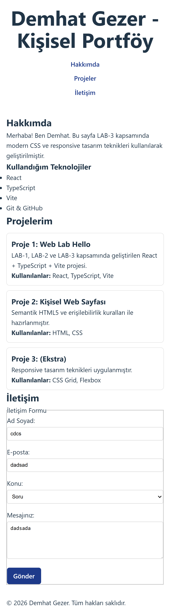
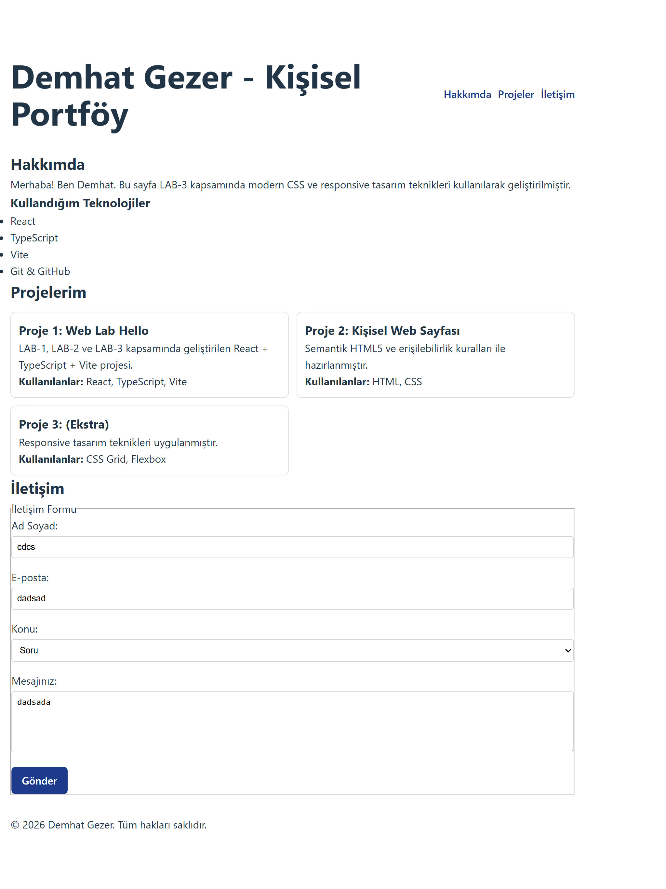
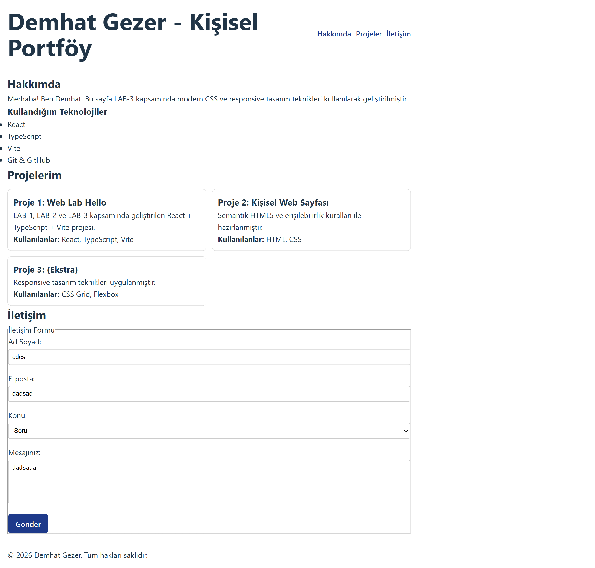

# Web Tasarımı ve Programlama - LAB 1

## Öğrenci Bilgileri
Ad Soyad: Demhat Gezer  
Öğrenci No: 230541080  

## Proje Açıklaması
Bu proje React + TypeScript + Vite kullanılarak oluşturulmuştur.
LAB-1 çalışması kapsamında temel proje kurulumu yapılmıştır.

## Kullanılan Teknolojiler
- React
- TypeScript
- Vite
- Git & GitHub
- ## LAB-3 Responsive Ekran Görüntüleri

### 📱 Mobil Görünüm

### 📲 Tablet Görünüm

### 🖥 Masaüstü Görünüm

